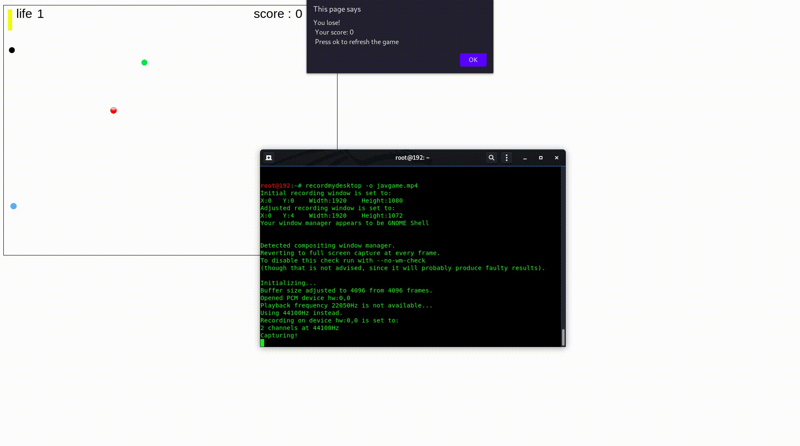

### Desc
A Stricker Games implemented in VanillaJS using Objected oriented programming principles.

### Usage
Just open index.html
### Help
1. User begins with 3 lives.
2. Red balls reduce life by 1
### Screenshot

### Note:
The Project was build for a fun way of implementing clean code and OOPS concepts in JS
